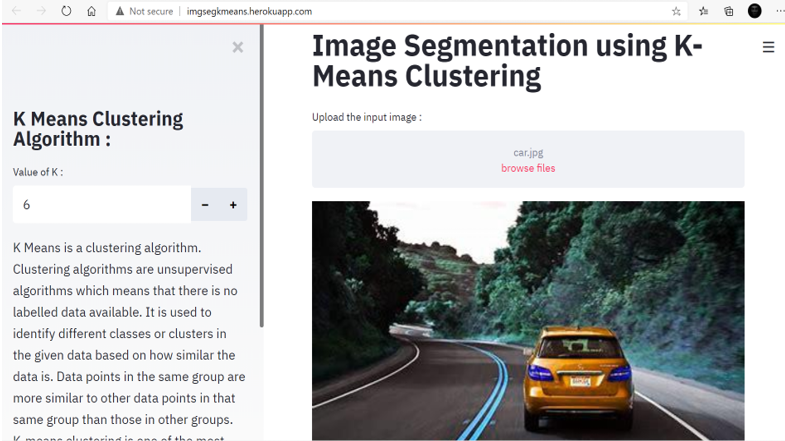
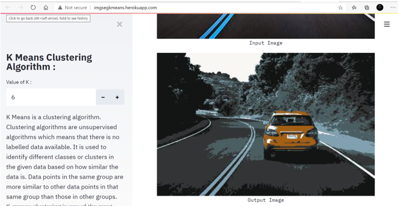

# kmeans_segmentation
Image Segmentation using K-Means Clustering

## Steps to run the model on localhost :
1) open terminal
2) type : streamlit run app.py
3) on any browser open : localhost:8501

## Steps to play around with the application :
1) In the main page, upload the input picture 
2) In the sidebar on the left, you can alter the hyperparameter "K" to observe different results.
3) Each time the value of k is altered, the screen refreshes itself to load the updated results.

Note : The extensions allowed : "jpg", "jpeg", "png"
         It is very easy to add custom extensions, just add them in the type list.

## Demo Snapshots :

